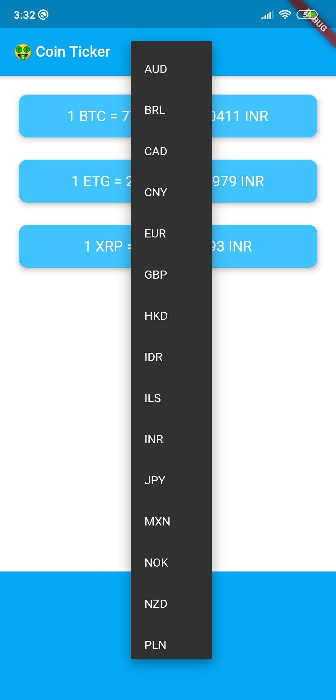

# Bitcoin Ticker 🤑

## Goal

We’re going to make a crypto currency price checking app. By this app, you'll be able to monitor your bitcoin investents on the move!

**IOS**

**Android**

## Stuff I learned

- How to use the DropdownButton Widget from Material design.
- How to loop through code using Dart for and for-in loops.
- How to use Cupertino Widgets in your app.
- How to check the platform your app is being run on to customise the UI for that platform.

  

